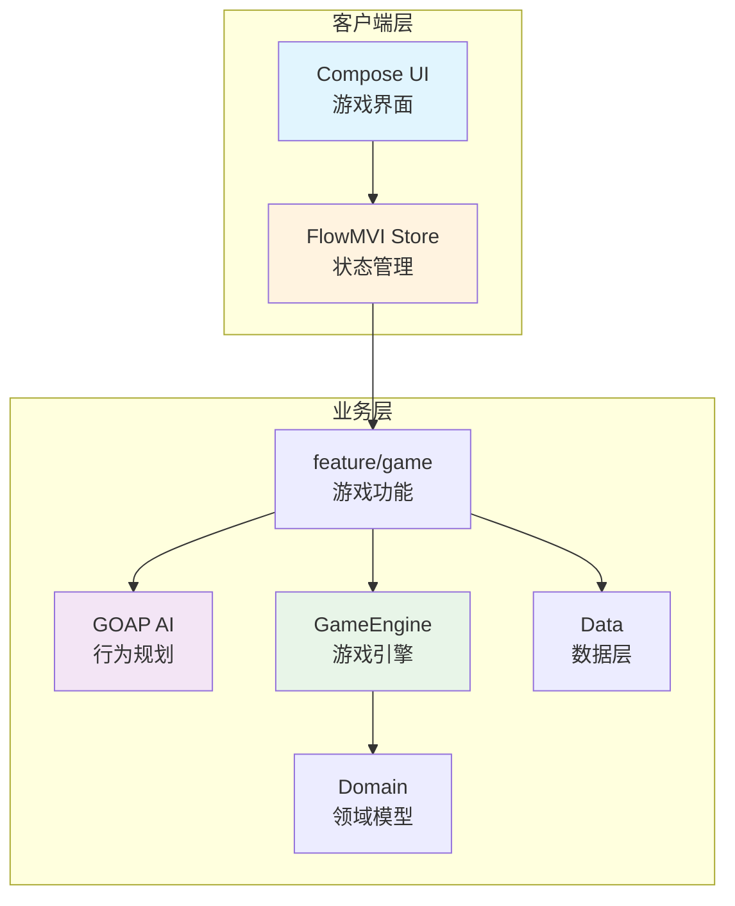

# Clever Knight（聪明骑士）

[](https://kotlinlang.org)
[](https://www.jetbrains.com/compose)
[](https://kotlinlang.org/docs/multiplatform.html)
[](https://github.com/arkivanov/FlowMVI)

一个基于 Kotlin Multiplatform 的智能游戏项目，采用 GOAP AI 系统驱动游戏角色决策。

## 核心特性

- **Kotlin Multiplatform**：一次编写，同时运行于 JVM 和 Android 平台
- **Jetpack Compose UI**：现代化的声明式 UI 框架，提供流畅的用户体验
- **FlowMVI 架构**：基于响应式流的 MVI 架构模式，确保状态管理的可预测性
- **GOAP AI 系统**：基于目标导向的行为规划，让游戏角色具备智能决策能力
- **桌面与移动端支持**：统一代码库，兼顾桌面和移动设备体验
- **Kodein 依赖注入**：轻量级的依赖注入方案，模块化组织代码
- **阿里云镜像加速**：国内开发者友好的依赖下载速度

## 项目亮点

Clever Knight 是一个展示现代 Kotlin 技术栈的游戏项目。它充分利用 Kotlin Multiplatform 的优势，将核心逻辑复用至不同平台，同时通过 Jetpack Compose 实现跨平台的响应式界面。项目的核心亮点在于引入了 GOAP（Goal-Oriented Action Planning）AI 系统，这是一种不同于传统状态机的智能决策方案。GOAP 允许游戏角色根据环境状态和可用资源自主规划行为序列，使得角色行为更加自然和富有变化。FlowMVI 架构则确保了整个应用状态流转的可追踪性和可测试性。结合 Kodein 提供的依赖注入机制，项目的模块边界清晰，易于维护和扩展。无论是学习 Kotlin Multiplatform 开发，还是研究游戏 AI 方案，Clever Knight 都是一个值得参考的实践项目。

## 快速开始

### 环境要求

- JDK 17+
- Android Studio Ladybug (2024.3.1) 或更高版本
- Android SDK 26+ (minSdk)

### 克隆项目

```bash
git clone https://github.com/j1046697411/quick-falcon.git
cd quick-falcon
```

### 构建项目

```bash
./gradlew assembleDebug    # 构建调试版
./gradlew assemble        # 构建所有目标
```

### 运行应用

```bash
./gradlew run             # 运行桌面应用
```

### 运行测试

```bash
./gradlew test            # 运行所有测试
./gradlew check           # 运行所有检查
```

## 架构说明

### 模块结构

```
quick-falcon/
├── app/                  # 应用入口模块
├── business/             # 业务逻辑模块
│   ├── data/            # 数据层（仓储、数据源）
│   ├── domain/          # 领域模型
│   ├── engine/          # 游戏引擎核心
│   ├── feature-game/    # 游戏功能模块
│   ├── goap/            # GOAP AI 系统
│   └── goap-framework/  # GOAP 框架
├── client/              # 客户端应用
│   └── src/
│       ├── commonMain/  # 共享代码（JVM + Android）
│       ├── androidMain/ # Android 特定代码
│       └── desktopMain/ # 桌面端特定代码
├── docs/                # 文档
└── gradle/              # Gradle 配置
```

### 客户端模块结构（FlowMVI）

```
client/src/commonMain/kotlin/com/sect/game/
├── mvi/                 # MVI 基础设施
├── feature/game/        # 游戏功能模块
│   ├── contract/       # 契约（State/Intent/Action）
│   ├── container/      # 容器（依赖注入）
│   └── presentation/  # 界面层
├── goap/               # GOAP AI 实现
├── domain/             # 领域模型
├── data/               # 数据层
├── engine/             # 游戏引擎
└── presentation/       # 共享 UI 组件
```

### 技术选型

| 技术 | 用途 | 说明 |
|------|------|------|
| **FlowMVI** | 状态管理 | 基于响应式流的 MVI 架构，确保状态可预测、可追踪 |
| **Compose Multiplatform** | 跨平台 UI | 声明式 UI 框架，复用至 JVM 和 Android |
| **Kotlin Multiplatform** | 跨平台 | 共享代码架构，同时支持 JVM 和 Android |
| **Kodein** | 依赖注入 | 轻量级 DI 方案，模块化组织代码 |
| **GOAP AI** | 游戏 AI | 目标导向行为规划，让角色具备智能决策能力 |

### 架构图



**数据流向**：

1. **UI 层**：用户交互产生 Intent
2. **Store 层**：Intent 经过处理，更新 State
3. **业务层**：State 变化触发 GOAP AI 决策或引擎更新
4. **反馈**：新的 State 驱动 UI 重渲染
